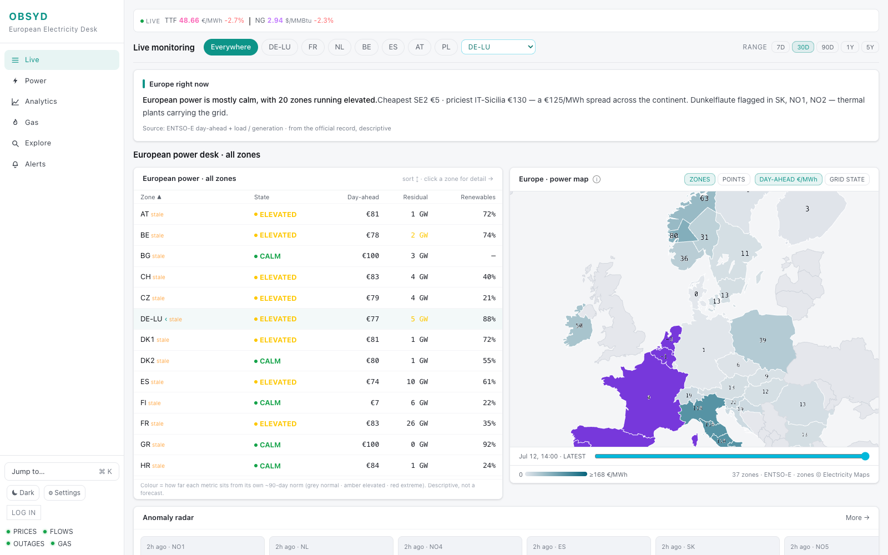

# OBSYD

**Open-source energy market intelligence. Correlates global ship movements with crude oil prices.**

[Live Demo](https://obsyd.dev) | [MIT License](LICENSE)



## Features

- **Vessel Map** — Global AIS tracking on deck.gl with geofence zones and STS hotspots
- **Chokepoint Monitor** — Hormuz, Suez, Malacca, Panama, Cape transit counts with Brent overlay
- **STS Detection** — Ship-to-ship transfer candidates, proximity pairs, dark vessel tracking
- **Price Charts** — WTI/Brent/NG/Gold candle + line charts (1D to ALL)
- **Market Structure** — Contango/backwardation with futures curve spreads
- **Correlation Engine** — Chokepoint flow vs. Brent price (Pearson r, lag optimization)
- **Rerouting Index** — Cape vs. Suez ratio to detect Red Sea avoidance
- **Morning Briefing** — Daily anomaly summary with historical Brent impact context
- **Signal Alerts** — Automated flow, weather, thermal, and chokepoint anomaly detection
- **Fundamentals** — EIA inventories, refinery utilization, SPR, imports/exports, JODI production

## Built With

**Backend:** FastAPI, SQLAlchemy, SQLite, APScheduler, Python 3.11+
**Frontend:** React 18, Vite, Tailwind CSS 4, deck.gl, Recharts, lightweight-charts
**Deployment:** Ubuntu 24.04, nginx, systemd, Let's Encrypt

## Quick Start

```bash
git clone https://github.com/jo20ow/obsyd.git
cd obsyd

# Backend
python3 -m venv .venv && source .venv/bin/activate
pip install -r requirements.txt
cp .env.example .env    # Add API keys (all optional)
uvicorn backend.main:app --reload

# Frontend
cd frontend
npm install
npm run dev             # http://localhost:5173
```

All API keys are optional — the dashboard works with partial data.

| Key | Source | Cost |
|-----|--------|------|
| `EIA_API_KEY` | [eia.gov](https://www.eia.gov/opendata/register.php) | Free |
| `FRED_API_KEY` | [fred.stlouisfed.org](https://fred.stlouisfed.org/docs/api/api_key.html) | Free |
| `AISHUB_API_KEY` | [aishub.net](https://www.aishub.net/) | Free tier |
| `AISSTREAM_API_KEY` | [aisstream.io](https://aisstream.io/) | Free tier |
| `FIRMS_API_KEY` | [firms.modaps.eosdis.nasa.gov](https://firms.modaps.eosdis.nasa.gov/api/area/) | Free |
| `FINNHUB_API_KEY` | [finnhub.io](https://finnhub.io/) | Free tier |

## Data Sources

| Source | Data | Frequency |
|--------|------|-----------|
| **EIA** | Crude prices, inventories, refinery util, SPR | Weekly |
| **FRED** | DXY, Fed Funds, 10Y/2Y yields, historical oil prices | Daily |
| **yfinance** | Live WTI/Brent/NG/Gold/Silver/Copper futures | 15 min |
| **AISStream** | Real-time AIS via WebSocket | Real-time |
| **AISHub** | Global AIS vessel positions | Every minute |
| **IMF PortWatch** | Chokepoint transit counts, disruption events | Daily |
| **GDELT** | News volume + tone for energy keywords | 15 min |
| **Finnhub** | Financial news headlines | 30 min |
| **NOAA** | Hurricane/weather alerts for Gulf Coast | 30 min |
| **JODI** | World oil production by country | Monthly |
| **NASA FIRMS** | Thermal hotspots near refineries (VIIRS) | 6 hours |
| **Twelve Data** | Commodity price fallback | On demand |
| **Alpha Vantage** | Commodity price fallback | On demand |

## Known Limitations

- **No satellite AIS** — terrestrial receivers only; vessels outside coastal range (~50 km) are invisible
- **Vessel counts, not barrels** — chokepoint data shows ship transits, not cargo volume or oil flow
- **yfinance is unofficial** — live prices may lag or fail; FRED daily prices serve as fallback
- **PortWatch delay** — IMF publishes transit data with a 3-5 day lag
- **SQLite** — single-writer database; sufficient for moderate traffic, not for high-concurrency production
- **AIS is self-reported** — vessels can spoof or disable transponders; data is unverified

## License

[MIT](LICENSE)

---

Built in ~24 hours with [Claude Code](https://claude.ai/claude-code).

OBSYD is a market observation tool, not financial advice. AIS data is self-reported and unverified. Correlations shown are statistical observations, not causal predictions. Not regulated by BaFin or any financial authority.
